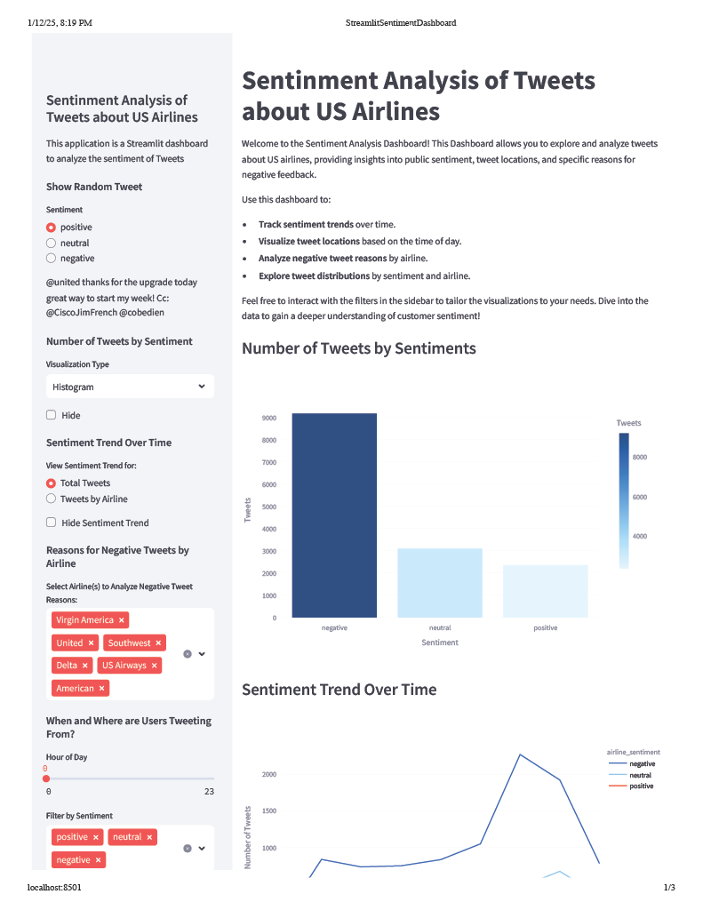
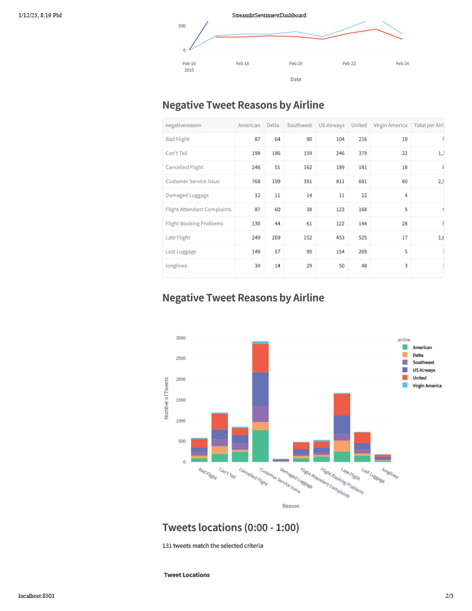
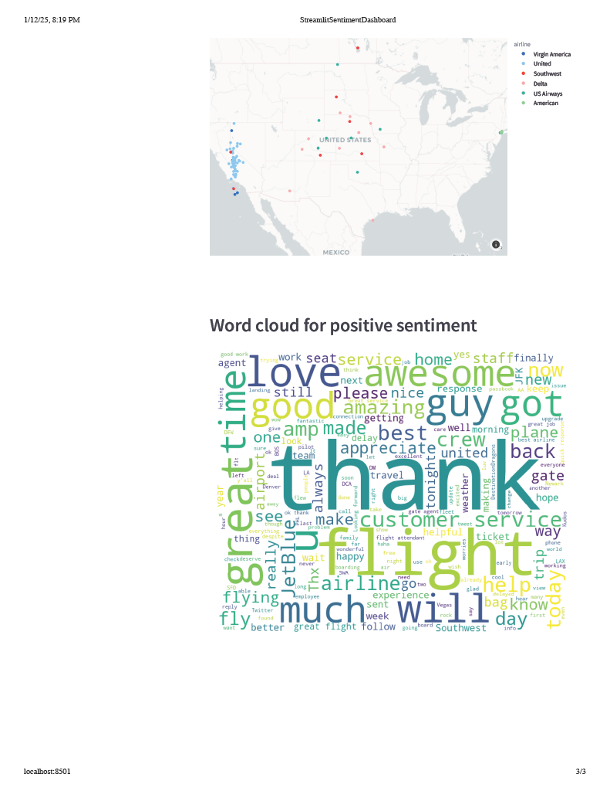
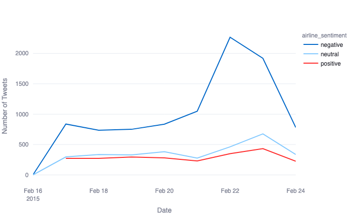
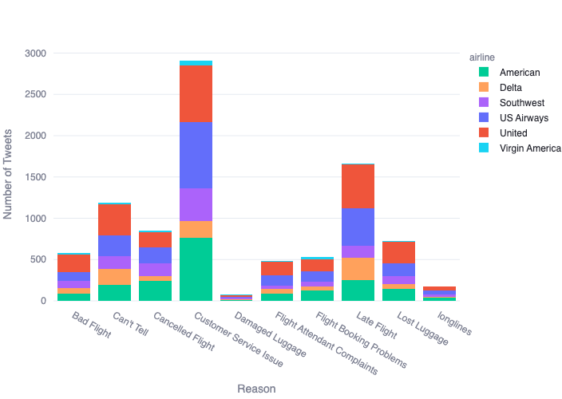
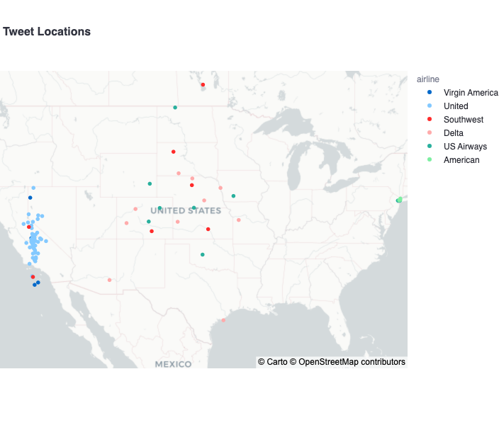

# Airline Sentiment Analysis Dashboard

This project is based on the Coursera course ["Create Interactive Dashboards with Streamlit and Python"](https://www.coursera.org/projects/interactive-dashboards-streamlit-python) by instructor Snehan Kekre.. It provides an interactive dashboard for analyzing sentiment in tweets about US airlines. The dashboard visualizes various insights, including sentiment distribution, tweet locations, and reasons behind negative sentiments.

  
  
  

## Updates From the Orginal Project

Some updates from the orginal project include:

- **Sentiment Trend Over Time**: A dynamic line chart showing how sentiment trends over time for all tweets or filtered by airline.
 
- **Reasons for Negative Tweets by Airline**: A pivot table displaying the top reasons for negative tweets by airline, along with a stacked bar chart showing the reasons for each airline. This helps identify patterns in customer complaints.

- **Updated Tweet Map**: Tweets are plotted on an interactive map with color coding by airline. The tooltips display the sentiment type and tweet content, making it easy to understand user sentiment in different regions.

#### Visualizations:

- **Sentiment Distribution**: Donut chart and histogram to visualize the sentiment breakdown of tweets.

#### Dataset:

- The dataset consists of tweets about US airlines and includes various columns such as sentiment, tweet text, tweet creation time, and more. The data is fetched directly from the GitHub repository folder: [Here](https://github.com/jwarner3rd/AirlineSentimentAnalysisDashboard/tree/main/data)
.
- The app also supports compatible CSV uploads from the sidebar. It recognizes
  common text, sentiment, timestamp, and airline column names, including
  `text`, `tweet`, `tweet_text`, `airline_sentiment`, `sentiment`,
  `predicted_sentiment`, `tweet_created`, `created_at`, `airline`, and
  `carrier`.
- Latitude and longitude are optional. If an uploaded CSV does not include
  coordinates, the map panel shows a clear message while the sentiment charts
  continue to work. This supports scored tweet exports from tools such as
  [TweetClaw](https://github.com/Xquik-dev/tweetclaw).
---
## Contact
For any questions or feedback, please contact:
- **Name**: John Warner
- **Email**: [john.warner.3rd@gmail.com](mailto:john.warner.3rd@gmail.com)
- **GitHub**: [jwarner3rd](https://github.com/jwarner3rd)
- **LinkedIn**: [www.linkedin.com/in/john-j-warner/](https://www.linkedin.com/in/john-j-warner/)
